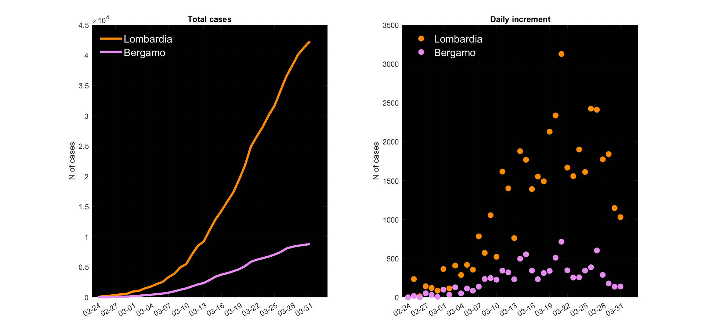

# COVID19-ita_city_tracker
A very easy-to-tun MATLAB script to plot and display the COVID19 diagnoses in any Italian city

This GitHub contains a MATLAB script that can be used to visualise the COVID19 diagnoses registered every day in Italy.
The script is based on the data registered by the Protezione Civile that are daily updated and available at this link https://github.com/pcm-dpc/COVID-19

The MATLAB script has to be in the same folder together with the downloaded data. 
The user has only to type in the name of the Italian city, and the script will plot a figure with two graphs: the number of total cases and the number of daily increments. 

 

Hope this may help! 

A Python version will follow.
